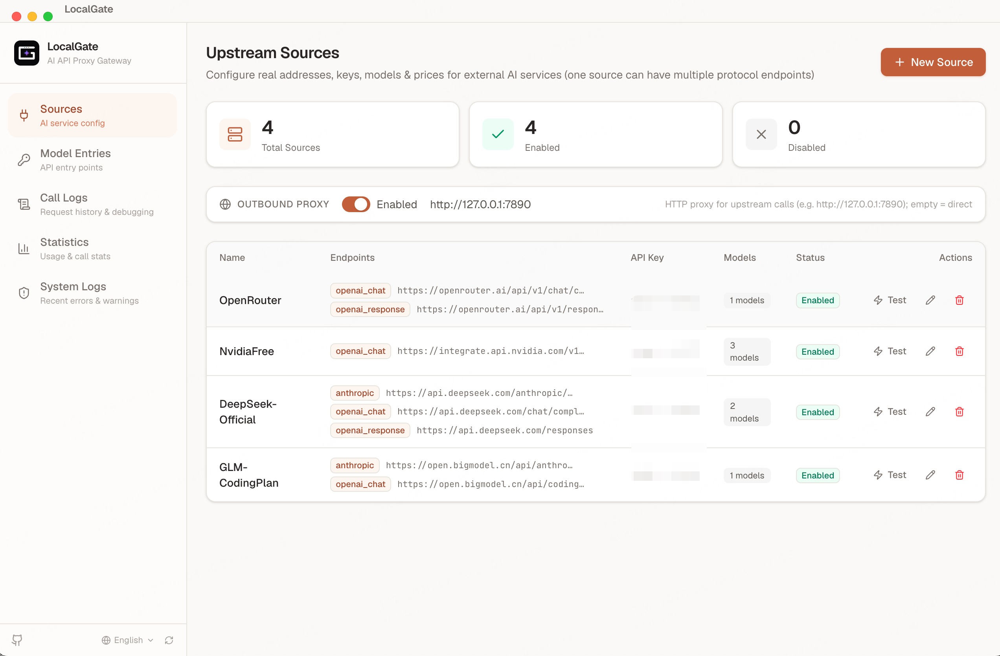
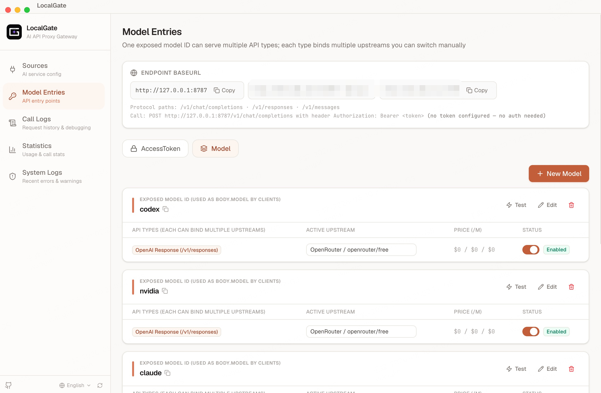
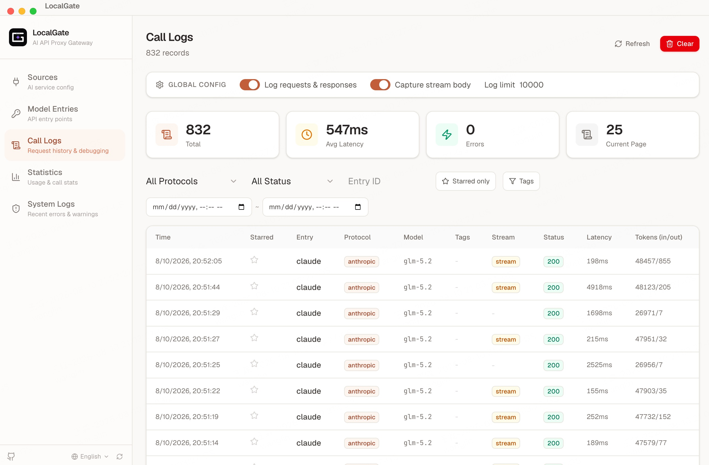
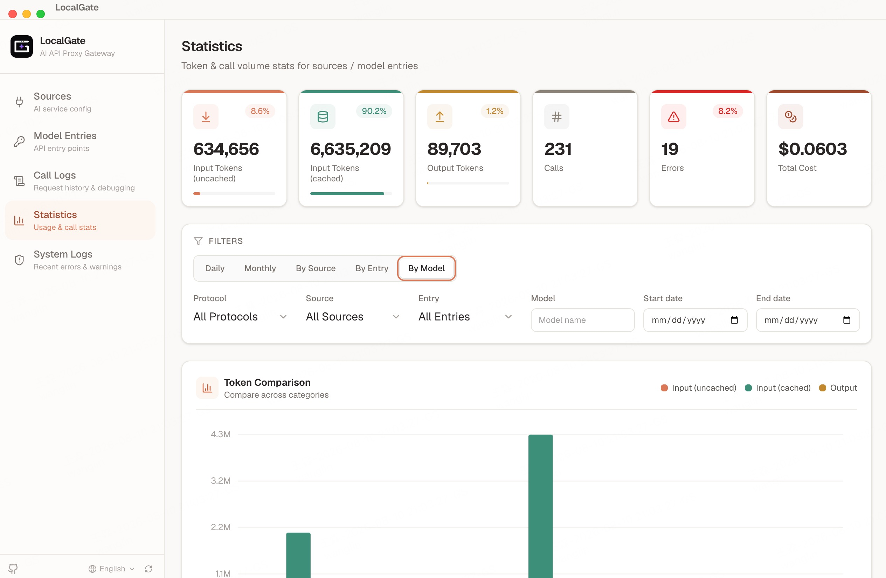

<p align="center">
  
</p>

# LocalGate

**A 100% local AI API proxy gateway — runs entirely on your own machine, no cloud, no sign-up. Unify multiple AI providers behind one endpoint with real-time logging, cost tracking, and usage analytics.**

[中文文档](README_zh.md)

## Why LocalGate?

When working with multiple AI providers (OpenAI, Anthropic, Azure, Ollama, etc.), you face common challenges:

- Each provider has different API formats and authentication methods
- Switching between providers requires changing code
- No visibility into token usage or costs
- No way to debug or inspect API calls

LocalGate solves all of this with a single local gateway. Point your app at LocalGate once, then manage providers, models, and routing through a visual dashboard — no code changes needed.

## Features

- **Unified API** — One endpoint format for OpenAI, Anthropic, and any OpenAI-compatible service
- **Model Aliasing** — Expose virtual model names (e.g., `gpt-4o`) and route them to any upstream provider
- **One-Click Switching** — Bind multiple upstreams to an entry, switch active upstream instantly
- **Full Request Logging** — Inspect every request and response, including streaming SSE content
- **Cost Tracking** — Set per-model pricing and see costs accumulate in real-time
- **Usage Analytics** — Token trends, breakdowns by source/entry/model, daily/monthly aggregation
- **Access Control** — Optional token authentication; open access when no tokens configured
- **Desktop App** — Native app for macOS, Windows, and Linux

## Quick Start

### Desktop App

Download the latest release from [GitHub Releases](../../releases):

- **macOS**: `.dmg` (arm64 for Apple Silicon, x64 for Intel)
- **Windows**: `.exe` installer (x64)
- **Linux**: `.AppImage` (x64)

Or build from source:

```bash
pnpm install
pnpm exec electron-rebuild -w better-sqlite3
pnpm run build
make run
```

### Run as Server

```bash
git clone https://github.com/your-username/localgate.git
cd localgate
pnpm install
./start.sh          # foreground (Ctrl+C to stop)
./start.sh -d       # or background mode
```

Open `http://localhost:8787` in your browser to access the dashboard.

## Usage Guide

### Step 1: Add an Upstream Source

Go to **Sources** → **New Source** to configure an AI provider:



- **Name**: A friendly label (e.g., "OpenAI Official", "Local Ollama")
- **API Key**: The provider's API key (shared across all endpoints)
- **Protocol Endpoints**: Add one or more protocol addresses — enter the **full API URL** including the path (not just up to `/v1`):
  - `openai_chat` → `https://api.openai.com/v1/chat/completions`
  - `openai_response` → `https://api.openai.com/v1/responses`
  - `anthropic` → `https://api.anthropic.com/v1/messages`
- **Models & Pricing**: Add supported models with optional per-token pricing (CNY/million tokens)

**Common source configurations:**

| Provider | Protocol | Full API URL |
|----------|----------|----------|
| OpenAI | openai_chat | `https://api.openai.com/v1/chat/completions` |
| Anthropic | anthropic | `https://api.anthropic.com/v1/messages` |
| Azure OpenAI | openai_chat | `https://{resource}.openai.azure.com/openai/deployments/{deployment}/chat/completions` |
| Ollama (local) | openai_chat | `http://localhost:11434/v1/chat/completions` |
| DeepSeek | openai_chat | `https://api.deepseek.com/v1/chat/completions` |
| Other compatible services | openai_chat | Varies |

### Step 2: Create a Model Entry

Go to **Model Entries** → **New Entry** to create a virtual API entry point:



- **Exposed Model Name**: The model name your clients will use (e.g., `gpt-4o`, `my-model`)
- **Inbound Protocol**: Which API format to accept (`openai_chat`, `openai_response`, or `anthropic`)
- **Upstream Bindings**: Select one or more source + model combinations

You can bind the same entry to multiple upstreams and switch between them at any time — perfect for failover or A/B testing.

### Step 3: Call the Proxy

Use the exposed model name in your requests. LocalGate handles the rest:

```bash
# OpenAI Chat format
curl http://localhost:8787/v1/chat/completions \
  -H "Content-Type: application/json" \
  -H "Authorization: Bearer YOUR_TOKEN" \
  -d '{"model": "gpt-4o", "messages": [{"role": "user", "content": "Hello!"}]}'

# Anthropic format
curl http://localhost:8787/v1/messages \
  -H "Content-Type: application/json" \
  -H "x-api-key: YOUR_TOKEN" \
  -H "anthropic-version: 2023-06-01" \
  -d '{"model": "claude-3", "max_tokens": 1024, "messages": [{"role": "user", "content": "Hello!"}]}'
```

**Use with any OpenAI SDK** — just change the base URL:

```python
# Python
import openai
client = openai.OpenAI(
    base_url="http://localhost:8787/v1",
    api_key="YOUR_TOKEN"
)
response = client.chat.completions.create(
    model="gpt-4o",
    messages=[{"role": "user", "content": "Hello!"}]
)
```

```javascript
// JavaScript
import OpenAI from 'openai';
const client = new OpenAI({
  baseURL: 'http://localhost:8787/v1',
  apiKey: 'YOUR_TOKEN',
});
const response = await client.chat.completions.create({
  model: 'gpt-4o',
  messages: [{ role: 'user', content: 'Hello!' }],
});
```

### Supported API Endpoints

| Protocol | Path | Auth Header |
|----------|------|-------------|
| OpenAI Chat | `POST /v1/chat/completions` | `Authorization: Bearer <token>` |
| OpenAI Responses | `POST /v1/responses` | `Authorization: Bearer <token>` |
| Anthropic Messages | `POST /v1/messages` | `x-api-key: <token>` |

Streaming (`"stream": true`) is fully supported for all protocols.

### Access Tokens

- **No tokens configured** → proxy is open, any key (or empty key) works
- **Tokens configured** → clients must send a valid token via `Authorization: Bearer <token>` or `x-api-key`
- Manage tokens in the dashboard: create, enable/disable, track last used time

### Call Logs & Debugging



Every proxied request is logged with:

- Full request and response bodies (including streaming SSE)
- Token counts (input, cached input, output)
- Latency, status code, error details
- Cost calculation based on upstream model pricing

You can **star** important logs, **tag** them for filtering, and view formatted or raw payloads in the detail page.

### Usage Statistics



The dashboard provides multiple views:

- **Token trends** — daily/monthly input/output token volume
- **Stacked charts** — breakdown by source, entry, or model
- **Cost tracking** — total cost with per-source/model breakdown
- **Filters** — narrow by date range, protocol, source, entry, or model

### Auto Log Retention

Logs are automatically capped at 10,000 entries. When the limit is reached, the oldest non-starred logs are trimmed. **Starred logs are never deleted.**

## Configuration

Create a `.env` file to customize:

```env
DB_PATH=.run/agent-proxy.db   # SQLite database path
PORT=8787                      # Server port
```

The database is auto-created on first launch. All data is stored locally in a single SQLite file.

## License

MIT
